[handistack.com](https://handistack.com) &nbsp;·&nbsp;
[email](mailto:cazurmendi@handistack.com)

> Founder at Handistack INC. — an AI implementation company. 
> Own the whole stack, or don't bother.

I build full-stack TypeScript products end to end: Next.js on the front, 
Convex on the back, self-hosted on AWS with Cloudflare in front. No per-seat 
SaaS where a container will do — the data stays in one account and the bill 
stays boring.

<samp>typescript &nbsp; next.js &nbsp; react &nbsp; convex &nbsp; node &nbsp; postgres &nbsp; docker &nbsp; aws &nbsp; cloudflare &nbsp; stripe</samp>

**[handistack-website](https://github.com/carlosazurmendi/handistack-website)** &nbsp;·&nbsp; <samp>next.js, typescript</samp> 
The company site for Handistack, an AI implementation shop — built the way 
we build for clients.

**[handistack-client-portal](https://github.com/carlosazurmendi/handistack-client-portal)** &nbsp;·&nbsp; <samp>next.js 16, convex</samp> 
Client portal and admin console as one application. A client signs in and 
sees one thing first: what needs them.

**[csa-website](https://github.com/carlosazurmendi/csa-website)** &nbsp;·&nbsp; <samp>next.js 16, payload cms</samp> 
Functional-safety marketing site, LMS and e-commerce in a self-contained 
bundle: ships its own Postgres, auth and S3 storage on a single Docker host.

**[claude-job-helper](https://github.com/carlosazurmendi/claude-job-helper)** &nbsp;·&nbsp; <samp>claude code</samp> 
A Claude Code workspace of subagents and skills that research, review and 
tailor resumes and cover letters.

Every graphic here is generated, not embedded from anyone else's server. 
`ascii.svg` is a photo pushed through a character ramp by 
[`scripts/make_portrait.py`](scripts/make_portrait.py); the stat graphics and 
these section headings are drawn by [a scheduled action](.github/workflows/stats.yml) 
straight from the GitHub GraphQL API, once a day, committing only what changed.

They animate with SMIL inside the SVG, because GitHub strips scripts from 
READMEs — and since nothing loads from a third party, nothing here can 
rate-limit or go dark. The headings are SVGs for the same reason: GitHub also 
strips CSS, so an image is the only way to put this page's own typeface on them.

The typeface is [JetBrains Mono](scripts/fonts), subset to just the characters 
each graphic draws and inlined as base64. That isn't only for looks: the 
portrait's grid assumes an advance width of exactly 0.600 em, and a viewer whose 
default monospace is narrower would otherwise see it squeezed.

Language totals cover public repositories only. `year.svg` uses the portrait's 
character ramp: `:` `+` `#` `@`, quiet to loud.

Built from [A GitHub profile that generates itself](https://agreeable-credit-859.notion.site/A-GitHub-profile-that-generates-itself-3abedfe9a65a81e4afc9daed90cb4e7e), 
with code from [andriidrok1/andriidrok1](https://github.com/andriidrok1/andriidrok1).
